# HeaSpot

**HeaSpot** — launcher kiểu **Spotlight (macOS) / Alfred** cho Windows, xây bằng **Tauri (Rust + React)**. Siêu nhẹ (~10 MB RAM khi ẩn), keyboard-first, mở tức thì.

### Mới trong v0.1.15

- **Kho xác thực 2FA/OTP cục bộ**: TOTP/HOTP, SHA-1/SHA-256/SHA-512, 6–8 chữ số, chu kỳ tùy URI; nhận secret Base32 có dấu cách và URI `otpauth://` của Google/Microsoft/OATH.
- Gõ `otp` để quản lý; gõ **`otp + <secret>` rồi Enter** để thêm nhanh, lưu tài khoản, sinh và copy OTP ngay. Secret trùng không tạo bản sao.
- Mỗi tài khoản có tên gợi nhớ, chú thích, ngày thêm/cập nhật, ghim, lưu trữ và lịch sử những OTP đã bấm Copy. Danh sách luôn xếp mục mới thêm lên đầu; secret có thể hiện/ẩn hoặc copy lại theo từng tài khoản.
- Secret và OTP history được mã hóa bằng **Windows DPAPI**. Backup di động `.heaspot2fa` dùng **Argon2id + AES-256-GCM**, giữ đầy đủ secret/cấu hình/chú thích/ngày/history và chống import trùng.
- Launcher tự ẩn ổn định khi chuyển sang ứng dụng khác và `Esc` luôn đóng launcher ở lớp native; cơ chế generation/intent loại bỏ callback focus cũ làm cửa sổ xuất hiện lại, còn native dialog của HeaSpot không bị nhận nhầm là mất focus.
- Gỡ cài đặt đối chiếu cả tên shortcut, nhóm Start Menu, vị trí cài và registry 32/64-bit; hỗ trợ tên lệch phiên bản như **7-Zip File Manager** ↔ **7-Zip 24.x (x64)**, MSI/UWP/portable và UAC. Tác vụ dài chạy nền trong cửa sổ tiến trình riêng nên launcher vẫn dùng bình thường; HeaSpot chặn tuyệt đối yêu cầu tự gỡ chính mình từ launcher.
- Sau khi uninstaller kết thúc thành công, chế độ dọn sâu chỉ xóa dấu vết có quan hệ chắc chắn với ứng dụng và hiển thị riêng mục đã xóa, bỏ qua hoặc thất bại; không tuyên bố “đã sạch” khi file còn bị khóa hay thiếu quyền.
- Auto-update dùng plugin updater chính thức của Tauri: tự kiểm tra sau khi khởi động, cửa sổ cập nhật riêng, release notes/thanh tải và bắt buộc chữ ký trước khi cài. Kênh release `canar1406/heaspot` và public key chính thức được cấu hình sẵn; có thể đổi tại **Settings → Cập nhật**.
- Hỗ trợ Microsoft **OATH-TOTP**. Push `Approve sign-in`, number matching, passwordless và cặp URL HTTPS + activation code vẫn thuộc giao thức đăng ký riêng của Microsoft Authenticator, không phải secret OTP.
- Search ưu tiên đúng **app/executable** hơn folder, installer và file trùng tên; app portable cũng được nhận diện và xếp hạng như ứng dụng.
- Everything 1.4 được nhúng làm engine nền của HeaSpot, cấu hình không tray/không admin; app chỉ quản lý đúng tiến trình bundled của mình và không đụng instance Everything riêng của người dùng.
- Clipboard hoạt động như danh sách MRU: copy lại nội dung cũ sẽ **move** item đó lên đầu thay vì nhân bản; vẫn giữ trạng thái ghim và dọn cache ảnh cũ.
- Thêm mục `emoji` riêng, tìm thông minh bằng tiếng Việt/Anh; các hộp xác nhận nội bộ thay thế dialog trình duyệt để không còn đè lớp giao diện.

## Phím tắt toàn cục

| Phím | Chức năng |
|---|---|
| `Alt + Space` | Mở / ẩn thanh tìm kiếm |
| `Win + V` | Mở Clipboard Manager kiểu Alfred |

> `Win+V` được bắt bằng low-level keyboard hook nên luôn thắng panel clipboard mặc định của Windows. Nếu `Alt+Space` bị PowerToys Run… chiếm, HeaSpot tự chuyển sang hook để vẫn hoạt động. **Chỉ đúng một hotkey clipboard bạn đặt trong Settings hoạt động** — không còn phím dự phòng ẩn nào khác.


## Cú pháp keyword (đổi được trong Settings → Keyword / Cú pháp)

| Gõ | Kết quả |
|---|---|
| `chrome` | Tìm & mở app / file / folder (icon thật) |
| `in <từ khoá>` / `doc:<từ khoá>` | Tìm **nội dung trong file** bằng Windows Search, tự fallback Everything `content:` **+ note Capacities** |
| `tr <từ>` | **Dịch + từ điển học thuật** (IPA, ví dụ, đồng/trái nghĩa, lưu vào danh sách ôn tập) |
| `wiki <khái niệm>` | Tra Wikipedia (preview) |
| `chem <ký hiệu/tên/Z>` | **Từ điển hóa học**: số proton, nguyên tử khối, phân loại. VD `chem Fe`, `chem oxy`, `chem 26` |
| `chem <công thức>` | **Phân tử khối**: `chem H2O`, `chem Ca(OH)2`, `chem C6H12O6` |
| `formula <tên>` | Công thức Toán / Lý / Hóa |
| `review` | Danh sách từ đã lưu để ôn tập |
| `= 100*(50+20)/2` / `=sin(pi/2)` | Máy tính nâng cao (lượng giác, hằng số) |
| `conv 60 km/h to m/s` / `conv 255 dec to hex` | **Đổi đơn vị mọi nhóm bản chất** + cơ số / ASCII |
| `time tokyo` / `time gmt+7` | Giờ thế giới |
| `g <từ khoá>` · `yt <từ khoá>` | **Kết quả nhanh Google** (preview) + tìm chi tiết · YouTube |
| `url github.com` | Mở URL |
| `#uuid` · `#md5 text` · `#b64 text` | Tạo UUID / hash / base64 |
| `ps <tên>` | **Task Manager** — gom process trùng tên; Enter/→ bung các PID con |
| `port 3000` | **Dev**: tìm & Kill tiến trình đang chiếm cổng TCP |
| `json` | **Dev**: format/minify/kiểm tra JSON trong clipboard |
| `jwt <token>` | **Dev**: giải mã JWT (header/payload, exp) |
| `pw <từ khoá>` | **Mật khẩu trình duyệt** đã lưu (bật trong Settings) |
| `otp` | Mở **kho 2FA/OTP**: mã sống, history, ghim, lưu trữ, chú thích và backup |
| `otp + <secret/otpauth URI>` | Thêm nhanh 2FA; `Enter` lưu, sinh và copy OTP hiện tại; không nhân bản secret trùng |
| `emoji <mô tả>` | Tìm emoji bằng tiếng Việt/Anh, ví dụ `emoji cảm ơn`, `emoji rocket` |
| `ocr` | Chụp một vùng màn hình và nhận dạng tiếng Việt + Anh offline |
| `< <tên>` | **Window Walker** — chuyển cửa sổ đang mở |
| `{ <tên>` | Mở project VS Code gần đây |
| `! <tên>` | Windows Services (→ Start/Stop/Restart) |
| `: hkcu\...` | Duyệt Registry |
| `> <lệnh>` | Chạy lệnh Terminal |
| `; ` | Snippets gõ tắt; thêm bằng `snip <keyword> <nội dung>` |
| `sys shutdown` / `sleep` / `lock` / `mute`… | Lệnh hệ thống |
| `settings` | Mở cửa sổ Cài đặt |
| `workflow` / `workflow install <path>` | Alfred Workflow (Python/Node/PHP/Ruby/Bash) |

Điều hướng: `↑ ↓` chọn · `Enter` mở · **`→` mở Context Menu** (Run as admin, Open location, Copy path, Kill…) · `Tab` điền · `Ctrl+1..9` mở nhanh · `Esc` đóng. Selection được giữ ổn định khi kết quả async cập nhật và chỉ trở về item đầu khi người dùng sửa truy vấn.

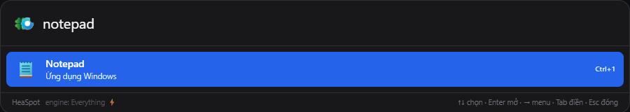

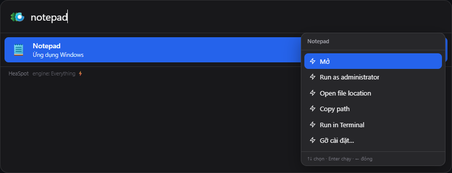

### Tìm app, file và gỡ cài đặt

- Kết quả được xếp hạng theo loại và độ khớp thực tế: app/executable chính xác đứng trên installer, folder và file phụ trùng tên. Thuật toán dùng exact, prefix, token/word-boundary, substring và subsequence; không chỉ vá riêng vài alias như `code`.
- App được lấy từ Start Menu, Registry App Paths, Registry uninstall entries và UWP/Store; executable portable do Everything tìm thấy cũng được nhận diện là app. Icon Shell/Appx vẫn được tải và cache bất đồng bộ để giao diện không khựng nhưng không mất icon thật.
- Nhấn `→` trên app để mở Context Menu: Open, Run as administrator, Open location, Copy path và **Gỡ cài đặt…**.
- Gỡ cài đặt tra đúng `UninstallString`/`QuietUninstallString` theo tên và đường dẫn app trong Registry, chuyển đăng ký MSI `/I` thành `/X`, xử lý UAC và chờ uninstaller tương tác của nhà phát hành kết thúc. HeaSpot không mở danh sách Control Panel thay cho thao tác gỡ.
- Launcher chỉ xác nhận và phát tác vụ. Cửa sổ **Tiến trình gỡ cài đặt** riêng có taskbar/thu nhỏ, không tự ẩn khi đổi focus và mở lại được từ khay hệ thống; vì vậy có thể tiếp tục dùng search/OTP/clipboard trong lúc gỡ lâu.
- Sau khi uninstaller thành công, HeaSpot quét hậu kỳ các dấu vết có quan hệ chắc chắn với ứng dụng: install path, thư mục product trong AppData/ProgramData, shortcut, khóa Registry uninstall và service có executable nằm trong install path. Kết quả bị khóa hoặc thiếu quyền được báo rõ, không bị tính là “đã sạch”.
- Với executable portable không có uninstall entry, HeaSpot chỉ cho xóa chính file `.exe` sau xác nhận nếu file nằm trong hồ sơ người dùng và không phải chính HeaSpot, tránh xóa nhầm phạm vi rộng.

Everything là engine con được đóng gói cùng HeaSpot. Bản bundled chạy nền bằng cấu hình riêng trong data directory, không có tray icon, không yêu cầu admin/service và kết thúc khi HeaSpot thoát. Khi phát hiện một Everything do người dùng tự cài, HeaSpot không kill, sửa cấu hình hay gỡ bản đó.

### Full-text trong tài liệu (`in`)

`in <từ khoá>` chỉ tìm **nội dung** trong các định dạng tài liệu/code được hỗ trợ ở thư mục người dùng. HeaSpot ưu tiên **Windows Search** vì index đảo cho kết quả nhanh, có xếp hạng và đoạn trích; nếu không tìm thấy, app tự fallback sang **Everything 1.4 `content:`** để quét cả file nằm ngoài vùng Windows đã index. Kết quả ghi rõ engine thực tế là `Windows Search` hay `Everything`. File thực thi và kho thành phần Windows (`.exe`, `.dll`, WinSxS, WindowsApps…) bị loại khỏi kết quả. Có thể kết nối Capacities để tìm đồng thời trong note.

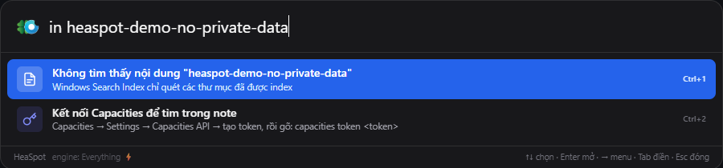

## Đổi đơn vị & cơ số (`conv`)

Đổi **mọi đơn vị cùng bản chất**, tính toán cục bộ nên tức thì. Các đơn vị được chia theo **nhóm bản chất** — chỉ đổi được trong cùng nhóm, đổi chéo giữa hai nhóm khác nhau sẽ báo lỗi rõ ràng thay vì âm thầm cho kết quả sai:

| Nhóm | Đơn vị hỗ trợ (một số) |
|---|---|
| Chiều dài | m, km, cm, mm, µm, nm, mi, ft, in, yd, nmi, ly |
| Khối lượng | kg, g, mg, µg, t (tấn), lb, oz, st, ct |
| Thời gian | s, ms, µs, ns, min, h, day, week, month, year |
| Dữ liệu | b, kb, mb, gb, tb, pb, bit, kbit, mbit, gbit (nhị phân 1024) |
| Nhiệt độ | °C, °F, K |
| Diện tích | m², km², cm², ha, are, acre, ft², in², mi², yd² |
| Thể tích | l, ml, m³, cm³, gal, qt, pt, cup, floz, tbsp, tsp, ft³, in³ |
| Tốc độ | m/s, km/h, mph, ft/s, knot |
| Áp suất | pa, kpa, hpa, bar, atm, psi, mmhg, torr, inhg |
| Năng lượng | j, kj, cal, kcal, wh, kwh, ev, btu |
| Công suất | w, kw, mw, hp, ps |
| Góc | deg, rad, grad, arcmin, arcsec, turn |
| Tần số | hz, khz, mhz, ghz, thz, rpm |
| Cơ số | bin ⇆ dec ⇆ hex ⇆ ascii (`conv 255 dec to hex`, `conv ff hex to bin`) |

Nối bằng `to` / `sang` / `ra` / `thành` / `=` / `->`. Ví dụ: `conv 60 km/h to m/s`, `conv 1 atm sang psi`, `conv 100 f to c`.

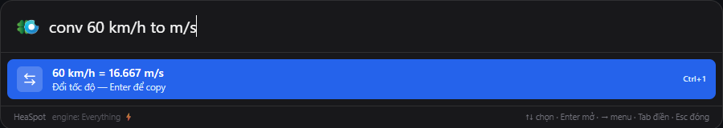

## Máy tính và thời gian

Máy tính nhận biểu thức sau `=` (hằng số, lượng giác, lũy thừa); `time <thành phố/GMT>` đổi giờ thế giới. Kết quả được tính cục bộ và `Enter` copy nhanh.

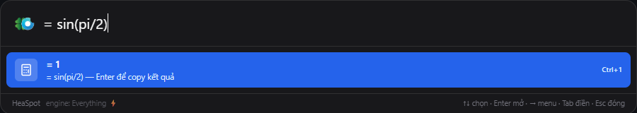

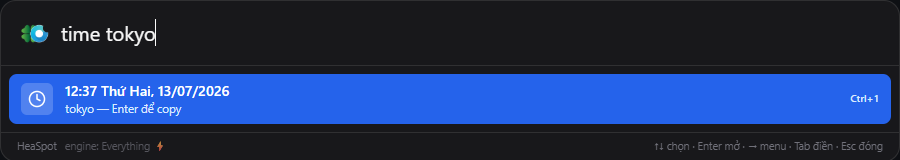

## Dịch, Wikipedia và công thức học tập

- `tr` hợp nhất dịch và từ điển: bản dịch hai chiều, IPA/audio, word forms, nghĩa Anh–Việt, ví dụ, collocation, đồng/trái nghĩa và lưu từ ôn tập.
- `wiki` tải tiêu đề nhanh trước rồi bổ sung phần mở đầu chi tiết trong preview.
- `formula` tra catalog Toán/Lý/Hóa offline; nếu chưa có thì fallback Wikipedia.

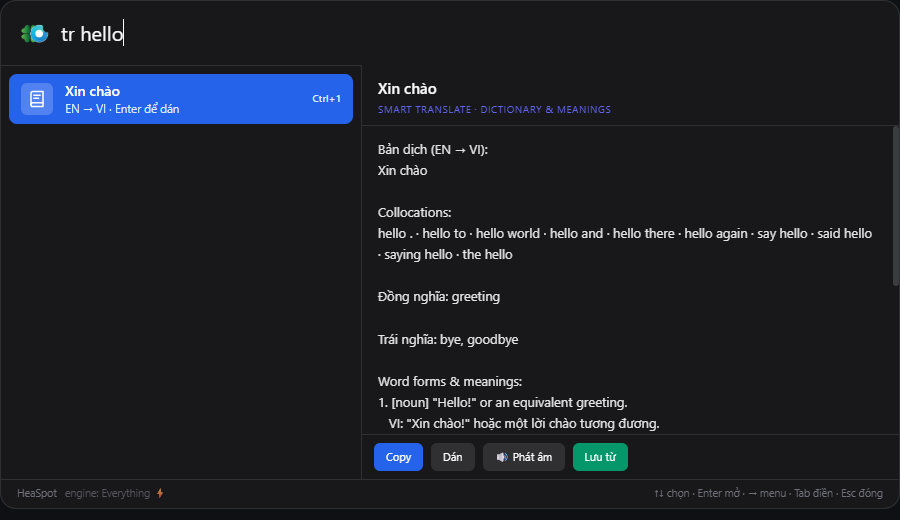

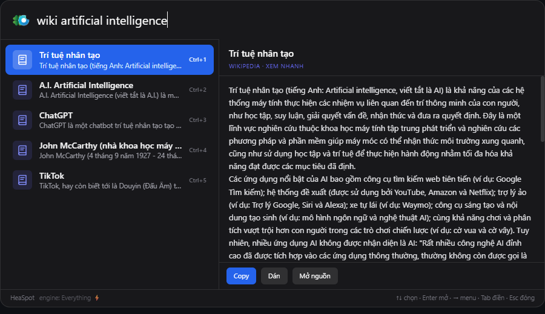

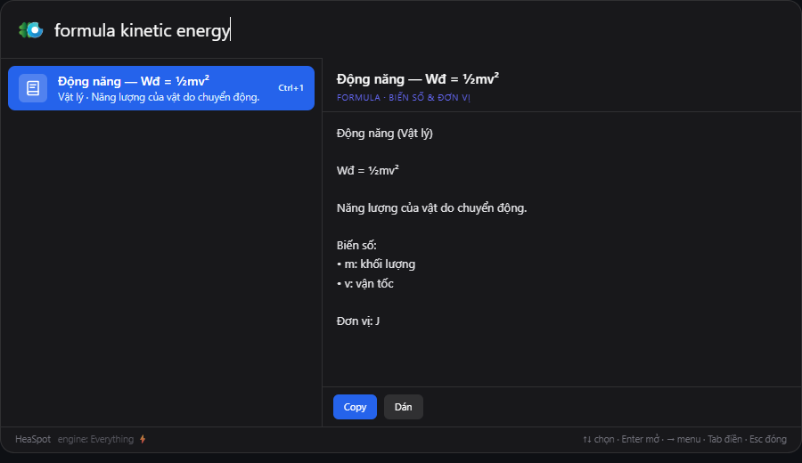

## Kết quả nhanh Google (`g`)

Gõ `g <từ khoá>`: HeaSpot lấy **kết quả nhanh của Google** (answer box / knowledge graph / snippet) và hiển thị ngay ở **khung preview bên phải**; bên trái có thêm dòng **"Tìm chi tiết với Google"** để mở trang tìm kiếm đầy đủ. Ưu tiên tốc độ: kết quả nhanh hiện trước, chi tiết bổ sung sau.

Nguồn dữ liệu dùng **Serper.dev** (gói miễn phí 2.500 lượt, không cần thẻ). Dán API key vào **Settings → Chung → Kết quả nhanh Google (g)** rồi Lưu; nếu để trống, HeaSpot tự lùi về DuckDuckGo Instant Answer. API key chỉ lưu cục bộ trong SQLite, không gửi đi đâu khác.

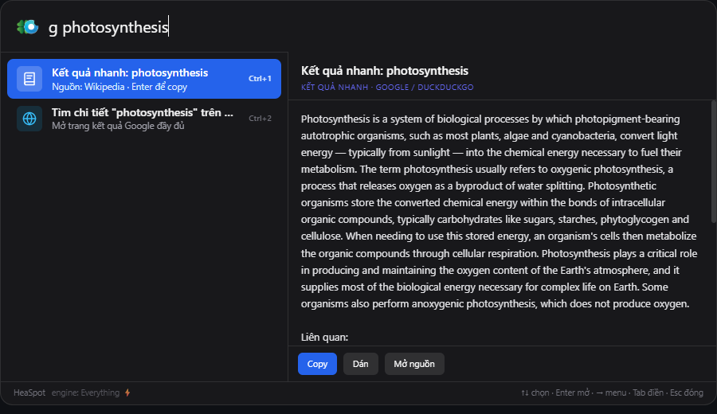

## Clipboard Manager (Win+V)

Giao diện 2 cột kiểu Alfred: danh sách bên trái, **preview chỉnh sửa trực tiếp** bên phải.

- Lưu **text, link, ảnh (thumbnail + preview), danh sách file** — dán file thật (CF_HDROP), không chỉ dán đường dẫn.
- Clipboard là danh sách MRU thực sự: copy lại nội dung đã có sẽ cập nhật thời gian và **move đúng item đó lên đầu**, không tạo thêm bản sao ở vị trí cũ; trạng thái ghim vẫn được giữ nguyên.
- `Enter` **auto-paste** thẳng vào cửa sổ trước · `⇧Enter` dán plain text · `Ctrl+1..9` dán nhanh
- `Ctrl+P` ghim (item ghim không bị xóa tự động) · `Ctrl+S` biến thành Snippet · `Del` xóa
- Mỗi hàng bên trái có icon **Ghim** và **Xóa** để click trực tiếp mà không làm mất focus bàn phím.
- Item vừa ghim được đẩy ngay lên đầu; bỏ ghim trả về thứ tự thời gian.
- Sửa nội dung là **tự lưu**. **Privacy Guard**: tự bỏ qua clipboard từ KeePass/Bitwarden/1Password…
- Tự dọn: giữ tối đa N item chưa ghim / theo số ngày (chỉnh trong Settings), tự xóa cache ảnh mồ côi.
- **Zoom ảnh trong preview**: lăn chuột để phóng to/thu nhỏ về phía con trỏ (1–10×), kéo để di chuyển, nút `+ / − / %`, double-click để reset. Áp dụng cho mọi khung xem ảnh.

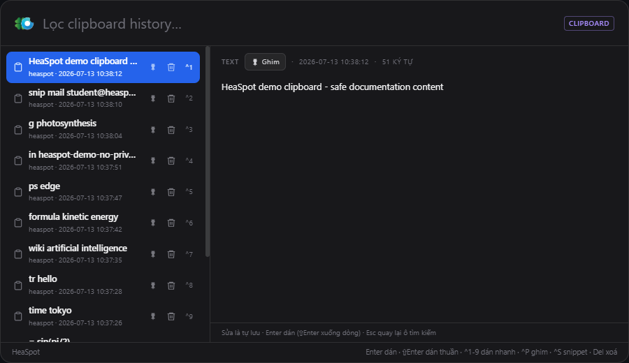

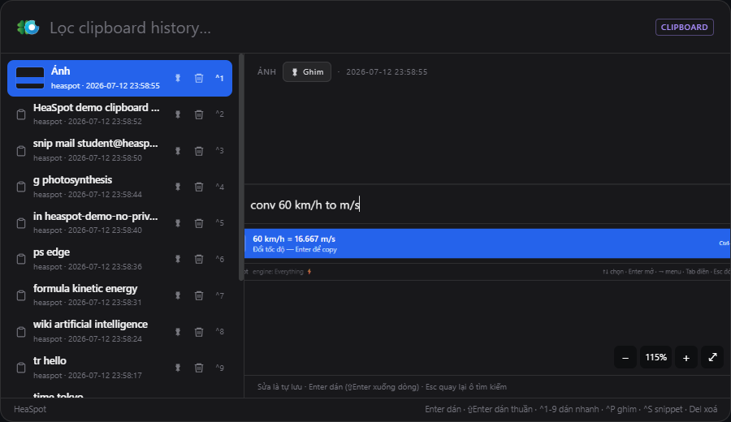

## Quản lý 2FA / OTP (`otp`)

HeaSpot có một kho authenticator cục bộ riêng, không cần mạng để tạo mã. Gõ `otp` để mở màn hình quản lý gồm **Đang dùng**, **Lưu trữ** và **Lịch sử copy**.

### Chuẩn và định dạng hỗ trợ

- `otpauth://totp/...` và `otpauth://hotp/...` chuẩn.
- Secret Base32 viết liền hoặc chia nhóm bằng dấu cách, `-`, `_`, có/không có padding `=`; tự viết hoa và sửa nhầm OCR phổ biến `0 → O`, `1 → I` vì Base32 chuẩn không dùng 0/1.
- TOTP/HOTP, SHA-1/SHA-256/SHA-512, 6–8 chữ số; chu kỳ TOTP 15–300 giây khi URI khai báo.
- Tự đọc `issuer`, tên tài khoản, thuật toán, số chữ số, period/counter từ URI và nhận diện nhãn Microsoft, Google hoặc OATH.

Ví dụ thao tác nhanh:

```text
otp + JBSW Y3DP EHPK 3PXP
```

Nhấn `Enter`: HeaSpot kiểm tra secret, tìm tài khoản đã tồn tại, tạo mới nếu cần, lưu secret, sinh mã hiện tại và copy mã để dán ngay. Nếu tài khoản trùng đang nằm trong Lưu trữ, nó được khôi phục về Đang dùng thay vì tạo bản thứ hai. Chuỗi sau keyword `otp` được chặn ngay tại router và không bao giờ đi tiếp sang Google/web search hoặc provider tìm kiếm khác.

Khi thêm bằng form, có thể đặt **tên gợi nhớ** và **chú thích** như email, công ty/phòng ban hay mục đích sử dụng. Mỗi thẻ hiển thị provider, TOTP/HOTP, thuật toán, mã sống, vòng đếm thời gian, ngày thêm và ngày cập nhật. Tài khoản mới thêm luôn đứng đầu danh sách; trạng thái ghim vẫn được lưu và hiển thị. Có thể hiện/ẩn và copy lại secret key của riêng từng tài khoản, đổi tên/chú thích, ghim, lưu trữ/khôi phục hoặc xóa bằng xác nhận hai bước.

History chỉ ghi những OTP người dùng thực sự bấm **Copy**; việc UI cập nhật mã mỗi giây không tự làm đầy lịch sử. HOTP tăng counter sau lần copy thành công. OTP và password được ghi vào clipboard bằng format `ExcludeClipboardContentFromMonitorProcessing`, vì vậy Windows Clipboard History và HeaSpot Clipboard Manager không thu lại secret/mã vừa copy.

### Lưu trữ và backup khi chuyển máy

- Trong SQLite, secret tài khoản và từng OTP history đều được mã hóa bằng **Windows DPAPI**, ràng buộc với user Windows hiện tại; database copy thô sang máy khác không giải mã được.
- **Xuất backup** tạo file `.heaspot2fa` chứa tài khoản, secret, cấu hình OTP, tên, chú thích, ghim, trạng thái lưu trữ, ngày tạo/cập nhật và history.
- Backup di động dùng khóa dẫn xuất **Argon2id** và mã hóa xác thực **AES-256-GCM** với salt/nonce ngẫu nhiên. Mật khẩu tối thiểu 8 ký tự và không được lưu trong app.
- **Nhập backup** kiểm tra định dạng/phiên bản, giải mã bằng mật khẩu, bỏ qua tài khoản trùng, tránh nhân đôi history khi import lại cùng file, rồi mã hóa lại dữ liệu bằng DPAPI của máy Windows mới.
- Không có cơ chế khôi phục mật khẩu backup. Cần giữ file và mật khẩu ở hai nơi an toàn khác nhau.

### Microsoft Authenticator: phần dùng được và giới hạn

HeaSpot thay thế được phần **OATH-TOTP** khi trang Microsoft cho chọn **I want to use a different authenticator app** hoặc **Use a verification code**. Microsoft Entra hỗ trợ authenticator bên thứ ba dùng OATH-TOTP nếu quản trị viên không vô hiệu hóa phương thức này: [Microsoft Learn — OATH tokens](https://learn.microsoft.com/en-us/entra/identity/authentication/concept-authentication-oath-tokens).

| Dữ liệu/luồng Microsoft | HeaSpot |
|---|---|
| Secret Base32 hoặc URI `otpauth://totp/...` | Hỗ trợ |
| Mã OTP 6 số đang chạy | Dùng để đăng nhập, **không** dùng để nhập tài khoản vì không suy ngược được secret |
| QR chuẩn OATH | Dùng được sau khi lấy secret/URI; v0.1.15 chưa đọc trực tiếp ảnh QR |
| URL `https://...` + activation code từ **Can't scan image** | Không hỗ trợ; đây là đăng ký thiết bị/push riêng, không phải secret TOTP |
| `Approve sign-in?`, number matching, passwordless | Vẫn cần Microsoft Authenticator |

Cặp URL HTTPS + activation code chỉ là cách nhập thủ công QR đăng ký Microsoft Authenticator; bước tiếp theo vẫn gửi notification thử đến thiết bị. Không dán cặp này vào `otp +`. Tài khoản cơ quan có thể bị admin bắt buộc dùng Microsoft Authenticator và ẩn lựa chọn authenticator khác; HeaSpot không vượt qua chính sách tenant. Xem luồng chính thức: [Microsoft Support — thiết lập Security info](https://support.microsoft.com/en-US/accounts-billing/work-school/set-up-security-info-from-a-sign-in-page).

## Snippets (`;`) — gõ tắt

**Snippet** là một đoạn văn bản mẫu **được lưu cố định** dưới một từ khoá ngắn, để dùng lại nhiều lần mà không phải gõ tay hay đi tìm để copy. Ví dụ lưu email, địa chỉ, số tài khoản, mẫu trả lời, chữ ký… dưới các keyword như `mail`, `stk`, `sign`.

Khác với clipboard history (lưu những gì bạn *vừa* copy và sẽ tự xoá theo thời gian), snippet **không bị tự xoá** — nó là thư viện văn bản riêng của bạn.

- **Tạo**: gõ `snip <keyword> <nội dung>` (VD `snip mail longvo@gmail.com`), hoặc trong Clipboard nhấn `Ctrl+S` để biến item đang chọn thành snippet.
- **Dùng**: gõ `;` để xem tất cả snippet, hoặc `;<keyword>` để lọc nhanh; `Enter` dán/copy nội dung.

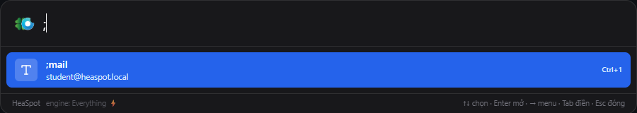

## Cửa sổ Settings

Cửa sổ Windows riêng (có viền, taskbar). Cho phép chỉnh: hotkey mở app, **keyword và global hotkey riêng của mọi tính năng**, theme (system/light/dark), auto-paste, giới hạn/thời gian lưu clipboard, Privacy Guard, tự khởi động cùng Windows, API key Serper cho `g`, và bật/tắt các tính năng nhạy cảm.

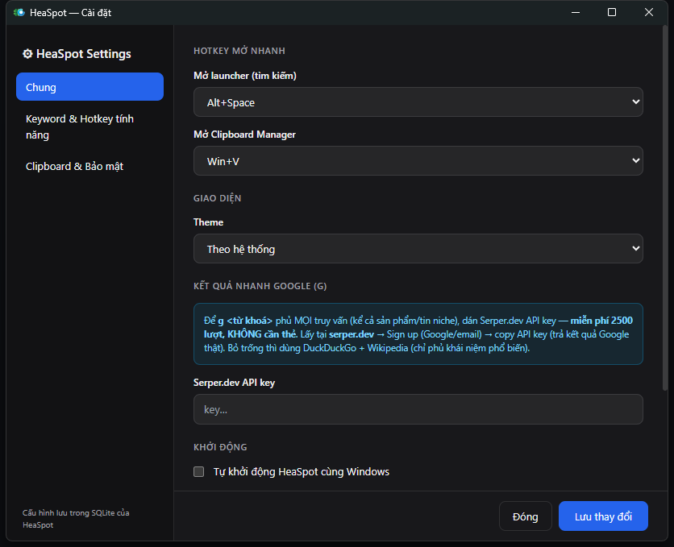

### Dọn cache toàn app (Clear cache)

Trong tab **Chung** có nút **🧹 Dọn toàn bộ cache ngay**: xoá **mọi cache tra cứu của tất cả tính năng** trong RAM (dịch, tra nhanh, Wikipedia, kết quả Google, full-text hybrid, Capacities, icon app/file) và các ảnh clip tạm mồ côi trên đĩa, rồi báo dung lượng đã giải phóng. Dành cho người dùng lâu ngày muốn dọn dẹp — **không** đụng tới clipboard history, snippet hay cấu hình đã lưu.

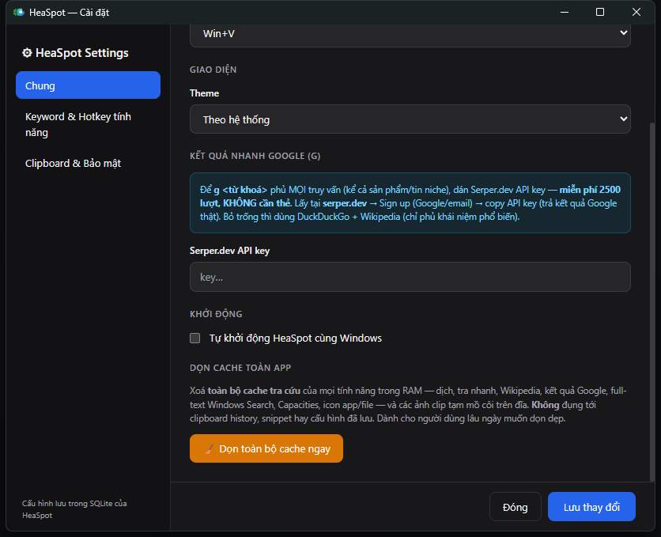

### Feature Hotkeys và text đang bôi đen

Trong tab **Keyword & Hotkey tính năng**, click ô Hotkey rồi nhấn tổ hợp mong muốn, ví dụ `Alt+Shift+T` cho Translate. Khi đang bôi đen nội dung ở trình duyệt/editor:

- Hotkey Translate mở `tr <selection>`.
- Hotkey Converter mở `conv <selection>`.
- Hotkey Formula/Wikipedia/Full-text mở feature tương ứng với selection.
- Nếu không có selection, HeaSpot mở sẵn keyword để nhập tiếp.
- HeaSpot copy selection tạm thời, khóa clipboard watcher và khôi phục clipboard text/ảnh cũ trước khi mở cửa sổ; không tự Enter/chạy hành động nguy hiểm.

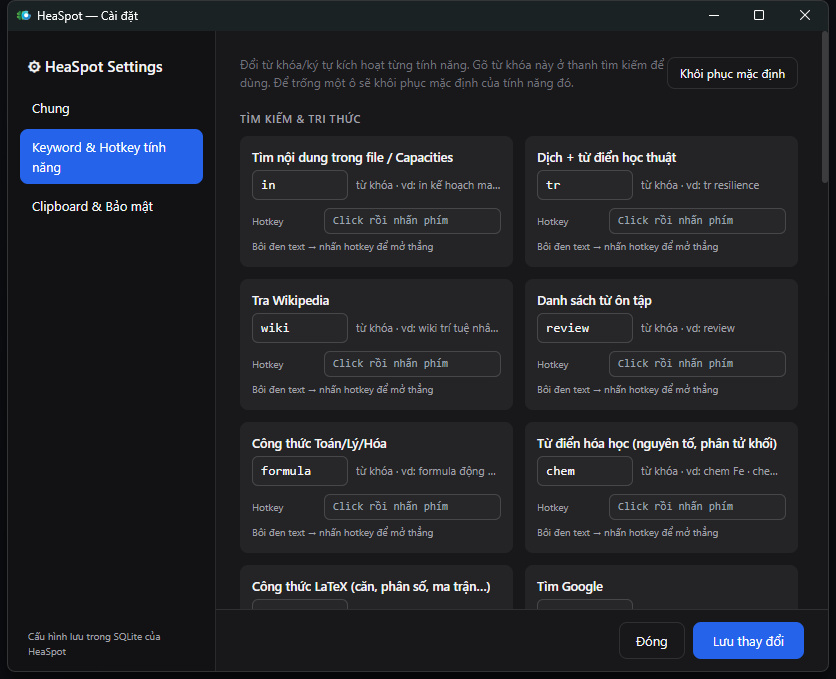

### OCR tiếng Việt

Gõ `ocr` hoặc gán hotkey riêng để chụp một vùng màn hình. HeaSpot tiền xử lý ảnh (phóng to chữ nhỏ, tăng tương phản và làm nét), sau đó ưu tiên **Tesseract 5 với model `vie+eng`**; không fallback âm thầm sang model tiếng Anh vì sẽ làm sai dấu. OCR chạy offline và không giữ ảnh tạm sau khi nhận dạng.

Khung **preview bên phải cho chỉnh sửa trực tiếp**: sửa văn bản OCR ngay tại chỗ, **tự lưu**, và nhấn `Enter` để **tự copy** kết quả đã sửa vào clipboard.

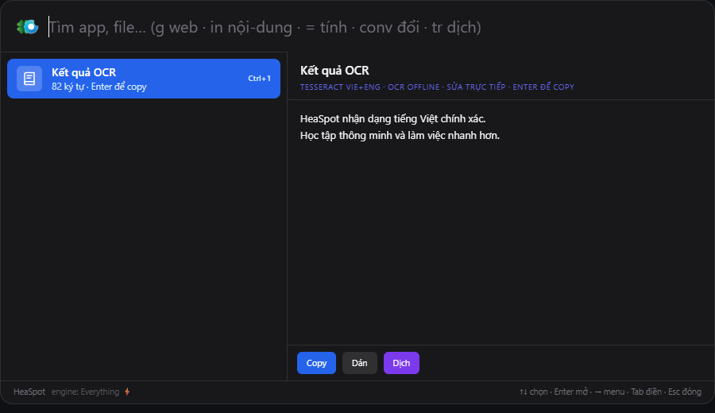

Bản phát hành đã **nhúng sẵn Tesseract 5 và hai model `vie+eng`** trong bundle, nên người dùng không phải cài language pack hay tải cache sau khi cài app. Bản Tesseract hệ thống/đường dẫn `HEASPOT_TESSERACT_PATH` chỉ là fallback cho môi trường development; Windows Media OCR chỉ được dùng khi hệ thống thực sự có recognizer `vi-*`.

## Tính năng nhạy cảm (mặc định TẮT)

- **Mật khẩu trình duyệt** (`pw`): đọc mật khẩu đã lưu trong Edge/Chrome/Brave/Cốc Cốc… của **chính tài khoản Windows đang đăng nhập** (giải mã DPAPI + AES-GCM, giống tính năng Export passwords của trình duyệt). Chỉ hoạt động cục bộ. Khi copy, mật khẩu **không lưu vào clipboard history** (có toggle riêng để đổi).
- **Task Manager dạng nhóm**: process trùng tên được gom thành một hàng tổng RAM/số instance; Enter hoặc → bung PID con, ← thu nhóm.
- **Kill tiến trình mạnh** (`ps` → bung nhóm → chọn PID → Kill): bật SeDebugPrivilege + TerminateProcess, fallback `taskkill /F /T` quyền admin.
- Search và detail preview giữ cùng chiều rộng; resize chiều cao có animation hủy frame cũ để tránh giật khi chuyển chế độ.

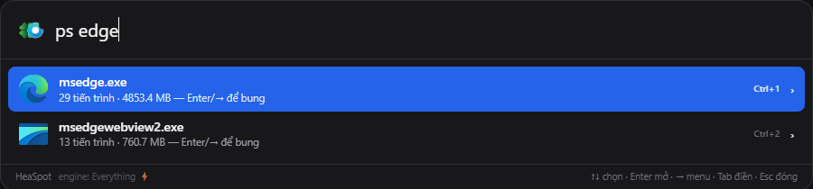

## Kiến trúc

### Tổng quan luồng dữ liệu

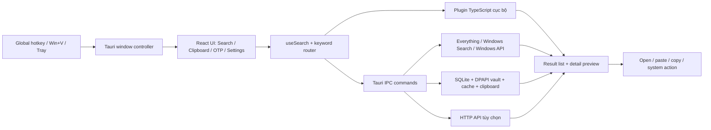

App là kiến trúc **desktop hai lớp**: WebView chỉ phụ trách giao diện và plugin tính toán an toàn; Rust giữ toàn bộ thao tác hệ thống, dữ liệu cục bộ và tài nguyên nhúng. Hai lớp trao đổi bằng Tauri IPC có kiểu dữ liệu Serde/TypeScript, không mở HTTP server cục bộ.

### Frontend (`src/`)

- **React 18 + TypeScript + Vite**: `App.tsx` điều phối Search/Clipboard và panel quản lý OTP; `main.tsx` dùng cùng bundle nhưng render `SettingsView` cho cửa sổ `settings`, `UninstallProgressView` cho tác vụ gỡ dài và `UpdateProgressView` cho tải/cài bản cập nhật.
- **Tailwind CSS + CSS toàn cục**: theme sáng/tối/system, layout hai cột, trạng thái selected/focus và các icon action.
- **Framer Motion**: animation mở launcher bằng opacity/scale/translate; không remount cây UI. Native window chỉ resize khi kích thước thật sự đổi để tránh khựng khi gõ/chuyển mode.
- **Router theo keyword trong `useSearch.ts`**: chỉ kích hoạt tính năng khi token đầu khớp đúng keyword (`in`, `tr`, `conv`, `ps`, `otp`…), debounce request async và dùng sequence guard để kết quả cũ không ghi đè truy vấn mới. Riêng secret sau `otp +` được giữ cục bộ và không chuyển sang provider tìm kiếm mạng.
- **Plugin chạy cục bộ trong `src/plugins/`**: calculator, converter/cơ số, timezone, công thức, hoá học, JSON/JWT, LaTeX, generator, URL/web/system command parser. Các phép tính này không gọi mạng.
- **Điều hướng bàn phím**: `useKeyboardNav` giữ selection hợp lệ khi list async thay đổi; Context Menu, nhóm process và Clipboard đều dùng chung quy ước ↑/↓/←/→/Enter/Esc.
- **Preview theo loại dữ liệu**: `KnowledgePreview` hiển thị dịch/từ điển/wiki/formula/OCR; `ZoomableImage` xử lý zoom theo con trỏ và pan ảnh; Clipboard preview hỗ trợ sửa tự lưu.

### Backend Tauri/Rust (`src-tauri/`)

- **Tauri 2** tạo launcher trong suốt, cửa sổ Settings riêng và system tray. `lib.rs` đăng ký state dùng chung (`RwLock` cho index app/file, `Mutex` cho SQLite) và toàn bộ IPC command.
- **`core/window.rs`**: show/hide/focus, resize native, giữ foreground window để auto-paste, trim working set khi ẩn và context menu gỡ cài đặt/run admin/open location.
- **`core/hotkey.rs`**: global shortcut mặc định và hotkey riêng từng feature; khi gọi trên đoạn đang bôi đen, app tạm copy selection, chặn clipboard watcher, khôi phục clipboard cũ rồi prefill keyword.
- **`core/indexer.rs` + `core/icons.rs`**: quét Start Menu, Registry App Paths và UWP/Store qua `Get-StartApps`; mở UWP bằng `shell:AppsFolder`; trích icon Shell hoặc asset trong AppxManifest và cache dưới dạng PNG data URL.
- **`commands/`**: search/full-text, clipboard, OTP/authenticator và backup mã hóa, settings, snippets, OCR, translate/wiki/Google quick answer, Capacities, study words và Windows system actions.
- **`plugins/` phía Rust**: process/task manager, services, registry, VS Code recent projects, window walker, browser passwords, Alfred Workflow và generator/hash.
- **Windows API qua `windows-sys`**: foreground/focus, phím giả lập, GDI/capture, Shell, COM, clipboard/CF_HDROP, process/token privilege, DPAPI, power/shutdown và memory trimming. PowerShell ẩn chỉ được dùng cho các bề mặt Windows phù hợp như UWP discovery, Windows Search OLE DB và một số system query.

### Các engine tìm kiếm

| Phạm vi | Engine chính | Fallback / kỹ thuật |
|---|---|---|
| App | Index nền Start Menu + Registry + UWP | Fuzzy score: exact → prefix → word boundary → substring → subsequence |
| Tên file/thư mục | Everything SDK qua `Everything64.dll` | Index nội bộ các thư mục người dùng nếu IPC Everything chưa sẵn sàng |
| Nội dung file (`in`) | Windows Search `Search.CollatorDSO` | Khi rỗng, Everything `content:` qua iFilter/UTF-8 |
| Note | Capacities API | Chạy song song với full-text khi đã cấu hình token |
| Wiki/dịch/Google | Wikipedia, Google Translate/Dictionary, Serper | Cache RAM; Google quick answer fallback DuckDuckGo khi chưa có key |

Everything 1.4.1 được nhúng và chạy nền ẩn. Để không đòi UAC hay cài Everything Service, engine portable của HeaSpot dùng **Folder Index + change monitor cho thư mục user home**. HeaSpot chỉ quản lý/kết thúc tiến trình có executable nằm trong tài nguyên bundled của chính app; một bản Everything do người dùng cài riêng sẽ không bị kill, sửa cấu hình hay gỡ cài đặt. SDK giữ trạng thái truy vấn cấp process nên backend đặt `Mutex` quanh mọi query, tránh search tên file và fallback `content:` ghi đè lẫn nhau. Với `in`, `content:` luôn đặt **sau** bộ lọc `file:`, đường dẫn home, danh sách extension và loại AppData/node_modules/.git/target/dist để giảm lượng file phải mở. Kho hệ thống WinSxS/WindowsApps/AppRepository, Recycle Bin và file `.exe/.dll` bị lọc khỏi kết quả.

### Dữ liệu, cache và vòng đời

- **SQLite bundled (`rusqlite`)** tại `%APPDATA%\heaspot\heaspot.db`, bật **WAL** để watcher ghi trong khi UI đọc. Bảng chính: `clipboard`, `snippets`, `settings`, `study_words`, `otp_accounts`, `otp_history`; migration cột chạy idempotent lúc mở DB.
- **Clipboard watcher** poll cục bộ, nhận text/link/image/file list (CF_HDROP), deduplicate theo kiểu MRU, phát event realtime và auto-prune theo số item/số ngày. Copy trùng chỉ cập nhật/move item cũ; item ghim được bảo toàn, còn ảnh PNG/thumbnail nằm trong thư mục `clips` cạnh DB.
- **Kho OTP** lưu metadata, cấu hình TOTP/HOTP và ngày tháng trong SQLite; secret và giá trị history được mã hóa riêng trước khi ghi. Việc import backup luôn chạy qua kiểm tra phiên bản, chống trùng và mã hóa lại cho user Windows hiện tại.
- **Cache RAM có giới hạn** cho icon, translate/wiki/quick answer/full-text/Capacities; nút Clear cache xoá cache lookup và ảnh mồ côi nhưng không xoá dữ liệu người dùng.
- **Everything/Tesseract là tài nguyên nhúng**. Tesseract 5 dùng model `vie+eng`; script build kiểm SHA-256 và chỉ đóng gói runtime/model cần thiết để không phình bộ cài hoặc sinh cache tải về.
- Biến `HEASPOT_DATA_DIR` chỉ dành cho smoke test/tài liệu: chuyển DB và cache sang profile tạm, bảo đảm quá trình chụp ảnh không đọc clipboard/settings thật.

### Bảo mật và riêng tư

- Mặc định các tính năng nhạy cảm như browser password bị tắt. Dữ liệu nhạy cảm cục bộ chỉ được giải mã trong đúng user session và không gửi mạng.
- Secret 2FA cùng giá trị OTP history được bảo vệ bằng **Windows DPAPI**. File backup di động dùng **Argon2id + AES-256-GCM**; app không lưu mật khẩu backup và không thể khôi phục nếu người dùng quên.
- Privacy Guard bỏ qua password manager cấu hình sẵn. OTP/secret được copy với format `ExcludeClipboardContentFromMonitorProcessing`, nên không quay lại Windows Clipboard History hoặc kho clipboard của HeaSpot.
- API key/token chỉ lưu trong SQLite cục bộ. Tính năng nào cần mạng đều tách khỏi search mặc định và chỉ chạy khi đúng keyword.
- Run as administrator, kill process và uninstall là hành động rõ ràng trong Context Menu; launcher không tự nâng quyền toàn bộ tiến trình.

### Build, kiểm thử và phát hành

- Frontend: `tsc` kiểm kiểu rồi Vite tạo bundle production. Backend: Rust unit tests kiểm parser/hotkey, UTF-8 PowerShell, bộ lọc search, query Everything fallback và 7 ca OTP gồm vector RFC 4226/6238, SHA-256/period 60 của Microsoft, HOTP, DPAPI, backup round-trip và quick-add chống trùng.
- `scripts/capture-readme.ps1` chạy bản release với profile tạm, thao tác launcher thật bằng hotkey, chụp từng tính năng và kiểm tra kích thước/foreground window; lỗi UI trong lúc chụp khiến script dừng.
- `scripts/focus-lifecycle-smoke.ps1` mở bản build với profile tạm, lặp chuyển foreground ngay trong cửa sổ race khi launcher vừa hiện, xác nhận HWND native tự ẩn và `Esc` không bị callback cũ làm cửa sổ xuất hiện lại.
- Release Rust bật `panic=abort`, LTO, một codegen unit, `opt-level=s` và strip symbol để giảm dung lượng.
- GitHub Actions trên `windows-latest` cài Node 20 + Rust stable, build Tauri/NSIS và ký updater; tag `v*` tạo release chính thức, còn workflow cũng có thể chạy thủ công.

## Phát triển

```bash
npm install
npm run tauri dev
```

Yêu cầu: Node.js, Rust (MSVC), VS Build Tools (C++), WebView2.

## Đóng gói .exe

```bash
npm run tauri build
```

Bộ cài NSIS ở `src-tauri/target/release/bundle/nsis/HeaSpot_*_x64-setup.exe`; bản hiện tại là `HeaSpot_0.1.15_x64-setup.exe`.

> Khi build lại trên máy đang chạy HeaSpot, hãy thoát HeaSpot để giải phóng executable/sidecar trong thư mục `target`. Không cần tắt hay gỡ bản Everything riêng của người dùng; tài nguyên đóng gói nằm ở `src-tauri/resources/heaspot-everything/`.

## CI — tự động release

`.github/workflows/release.yml`:
- Đẩy tag `v*` (VD `git tag v0.1.15 && git push --tags`) → tạo **release chính thức** kèm bộ cài.
- Có thể chạy thủ công bằng `workflow_dispatch`; push thường lên `main` không tự phát hành để tránh đưa build chưa gắn version vào kênh stable.

### Auto-update có chữ ký

Workflow [`.github/workflows/release.yml`](.github/workflows/release.yml) build NSIS trên Windows, ký updater artifact và tải `latest.json` lên GitHub Release. Trước khi push tag:

1. Tạo cặp khóa bằng `npm run tauri signer generate -- -w ~/.tauri/heaspot.key`. Private key không được commit; `.gitignore` đã chặn `*.key`.
2. Thêm private key và password vào GitHub Secrets `TAURI_SIGNING_PRIVATE_KEY` và `TAURI_SIGNING_PRIVATE_KEY_PASSWORD`.
3. Bản chính thức đã tích hợp endpoint `https://github.com/canar1406/heaspot/releases/latest/download/latest.json` và public key. **Settings → Cập nhật** chỉ cần dùng khi muốn đổi sang kênh phát hành/khóa khác.
4. Tăng version rồi push tag `vX.Y.Z`. Tauri Action tạo installer, `.sig` và `latest.json`; ứng dụng chỉ cài khi chữ ký khớp.

Không thể tắt xác minh chữ ký của updater. Build phát hành cần hai biến môi trường ký; build local kiểm thử có thể override `bundle.createUpdaterArtifacts=false` nhưng không tạo được gói auto-update.
